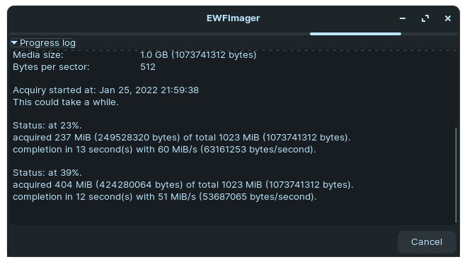

# ewfimager
_GTK GUI for ewfacquire_

`ewfimager` is a `bash` script that provides with `yad` a graphical interface to the command line tool `ewfacquire`.


## prerequisites

- `bash`, `dd`, `grep`, `kill`, `mkfifo`, `rm`, `sed`, `tail`, `touch`, `tr` (usually available on Linux)
- `ewfacquire` (https://github.com/libyal/libewf)
- `yad` (https://github.com/v1cont/yad)


## installation

[download](https://raw.githubusercontent.com/patatetom/ewfimager/main/ewfimager) `ewfimager` script,
save it (preferably in one of the PATH folders : `~/.local/bin/` for example),
check it (with `less /path/to/ewfimager` for example)
and make it executable (with `chmod +x /path/to/ewfimager`).

## usage

```console
# usage : ewfimager [input [output]]

# without parameter
ewfimager

# with input only
ewfimager /dev/nvme0n1p1

# with input and output
ewfimager /dev/nvme0n1p1 /tmp/test/nvme0n1p1.img.E01

# with output only
ewfimager '' /tmp/test/nvme0n1p1.img.E01
```


## screenshots





